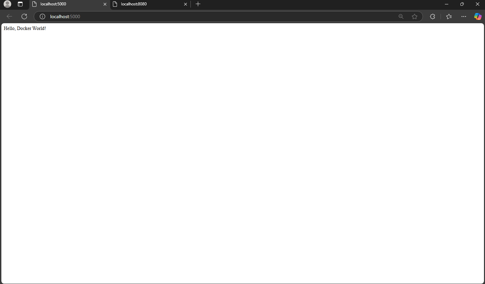

Hafiz Ilmi
235150209111005

# Lab 1: Membangun dan Menjalankan Docker Image Kustom

Proyek ini menjelaskan langkah-langkah membangun dan menjalankan aplikasi Python sederhana di dalam container Docker. Anda akan belajar membuat file sumber, menulis Dockerfile, membangun image, menjalankan container, dan memverifikasi hasil.

## Langkah-langkah

### 1. Membuat Direktori Proyek
Jalankan perintah berikut di terminal untuk membuat direktori proyek dan masuk ke dalamnya:
```cmd
mkdir my-python-app
cd my-python-app
```

### 2. Membuat File `app.py`
Buat file `app.py` dengan editor teks dan isi dengan kode berikut:
```python
from flask import Flask

app = Flask(__name__)

@app.route('/')
def hello_world():
    return 'Hello, Docker World!'

if __name__ == '__main__':
    app.run(host='0.0.0.0', port=5000)
```

### 3. Membuat File requirements.txt
```python
flask
```

### 4. Menulis Dockerfile
```cmd
# Menggunakan image Python resmi versi 3.8 dengan slim
FROM python:3.8-slim

# Menetapkan direktori kerja di dalam container
WORKDIR /usr/src/app

# Menyalin semua file dari direktori lokal ke direktori kerja di dalam container
COPY . .

# Menginstal semua dependensi yang terdaftar di requirements.txt
RUN pip install --no-cache-dir -r requirements.txt

# Mengekspose port 5000 untuk diakses dari luar container
EXPOSE 5000

# Menjalankan aplikasi saat container dijalankan
CMD ["python", "app.py"]
```

### 5. Membangun Image Docker
```cmd
docker build -t my-app .
```

### 6. Menjalankan Container
```cmd
docker run -p 5000:5000 my-app
```

### 7. Verifikasi
Buka browser dengan http://localhost:5000

### 8. Hasil browser
