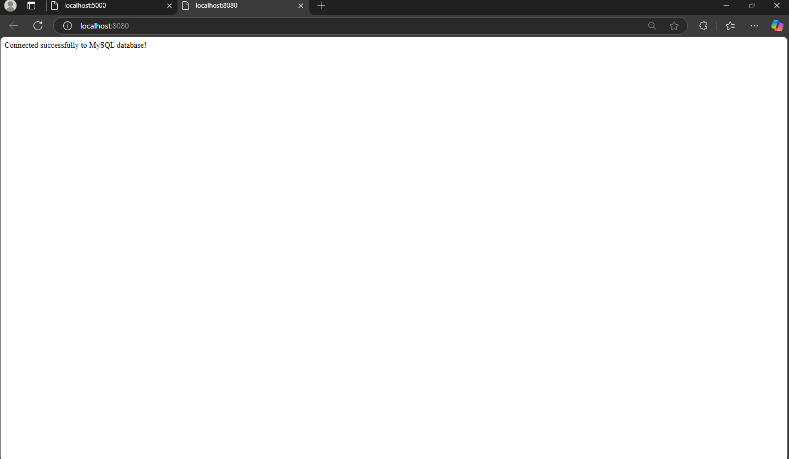

Hafiz Ilmi
235150209111005

# Lab 2: Docker Compose untuk Multi-Container

Proyek ini menunjukkan cara mengatur aplikasi multi-container menggunakan Docker Compose. Aplikasi ini mencakup server PHP dengan Apache dan database MySQL.

## Langkah-langkah

### 1. Membuat Struktur Aplikasi
Jalankan perintah berikut di terminal untuk membuat direktori proyek dan masuk ke dalamnya:
```cmd
mkdir my-php-app
cd my-php-app
```

### 2. Membuat File `index.php`
Buat file `index.php` dengan editor teks dan isi dengan kode berikut:
```php
<?php
$servername = "db";
$username = "root";
$password = "example";
$dbname = "test_db";

// Membuat koneksi
$conn = new mysqli($servername, $username, $password, $dbname);

// Memeriksa koneksi
if ($conn->connect_error) {
    die("Connection failed: " . $conn->connect_error);
}

echo "Connected successfully to MySQL database!";
?>
```

### 3. Membuat File docker-compose.yml
```yml
version: '3.8'
services:
  web:
    image: php:8.0-apache
    volumes:
      - ./index.php:/var/www/html/index.php
    ports:
      - "8080:80"
    depends_on:
      - db
  db:
    image: mysql:5.7
    environment:
      MYSQL_ROOT_PASSWORD: example
      MYSQL_DATABASE: test_db
    volumes:
      - db_data:/var/lib/mysql
volumes:
  db_data:
```

### 4. Menjalankan Stack
```cmd
docker-compose up -d
```

### 5. Akses Aplikasi
Buka browser dengan http://localhost:8080

### 6. Hasil browser
