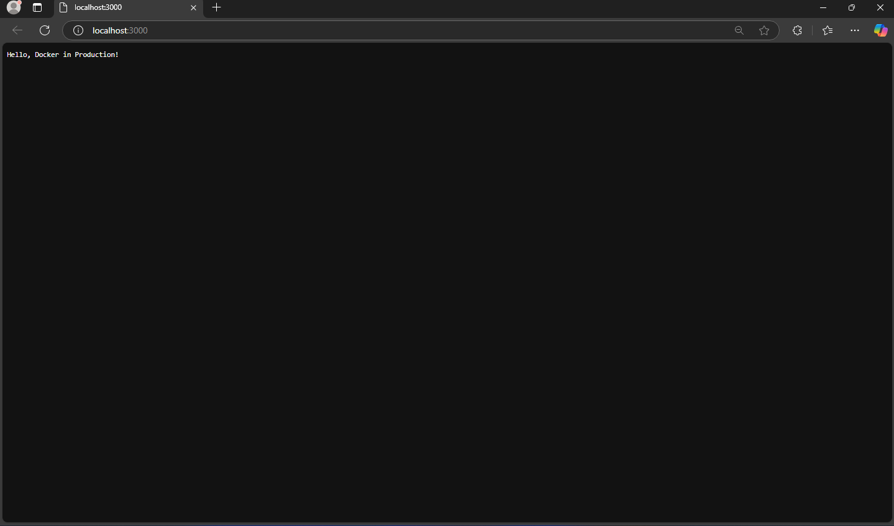

Hafiz Ilmi
235150209111005

# Lab 5: Docker in Production

## Deskripsi Proyek
Proyek ini adalah contoh aplikasi Node.js sederhana yang digunakan untuk mempelajari praktik terbaik Docker di lingkungan produksi. Aplikasi ini menjalankan server HTTP yang menampilkan pesan "Hello, Docker in Production!".

## Prasyarat
- Docker Desktop diinstal pada Windows 11.
- Node.js diinstal secara lokal untuk pengembangan.

## Langkah-langkah untuk Membuat dan Menjalankan Docker Image
1. **Bangun Image Docker**
   Jalankan perintah berikut untuk membangun image:
   ```bash
   docker build -t my_image .
   ```

2. **Jalankan Container**
   Jalankan perintah berikut untuk membangun image:
   ```bash
   docker run --user myuser:myuser -p 3000:3000 my_image
   ```

3. **Akses Aplikasi**
   Buka browser dengan http://localhost:3000

4. **Hasil Browser**
